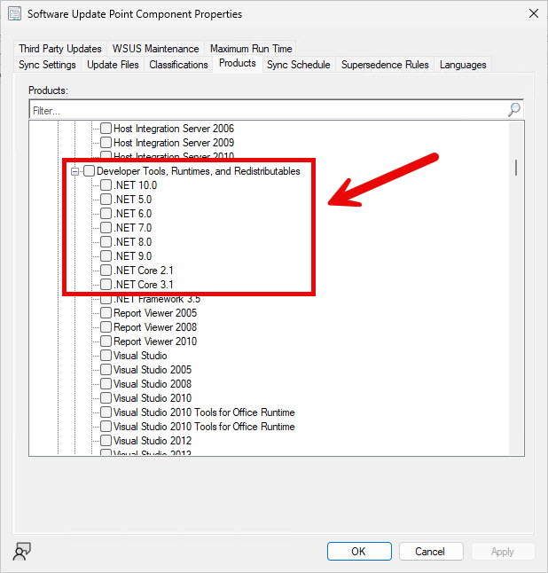
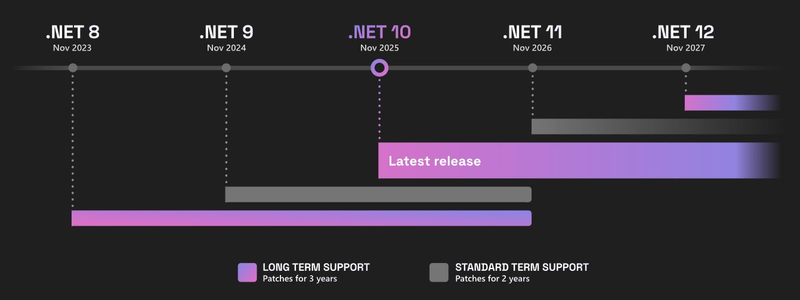

# .NET Framework vs .NET: for the SysAdmin

If you've ever stared at a vulnerability report flagging multiple .NET versions and wondered which ones you actually need to patch, or tried to work out whether a piece of software needs .NET Framework or just .NET, you're not alone. Most articles on this topic are written for developers. This one isn't.

This article is intended to help you understand the difference between .NET Framework and the newer .NET (Core), and highlight the responsibilities and challenges faced with managing software dependencies on Windows today - particularly with .NET (Core).
## What's the difference?
**.NET Framework** is a Windows-only runtime that ships _with_ Windows, first released in 2000, and is patched through Windows Update, ConfigMgr, or WSUS. With Windows 10, Microsoft made 4.x installed by default, whereas with Windows 7, it was separately installed because 3.x was installed by default.

**.NET (*formerly .NET Core*)** is a cross-platform runtime, first released in 2016, that is completely separate from Windows. It's a standalone install, versioned and patched independently. It does not come with Windows by default. If software needs .NET 8, 9, or 10, something has to put it there - whether that's the application installer itself, or you deploying it via Intune, ConfigMgr, or your chosen RMM as a prerequisite. 
## What actually is .NET? 
.NET is a collection of libraries organised into classes and methods that developers reference when building applications, executed at runtime by the .NET runtime.

If that sentence meant nothing to you, keep reading!

When a developer writes an application, they don't build everything from scratch. Things like "open a file", "make a network request", or "display a window" are common problems that have already been solved. .NET is a big box of pre-built solutions to those common problems which developers can leverage as reusable code. This enables developers to focus more on driving the outcomes that makes their application unique rather than reinventing the wheel on some things.

The Software Development Kit (SDK) is the full toolkit the developer installs on their machine to build software using that box. It includes everything needed to write, compile, and test .NET applications.

The "runtime" is the slimmer component that end-user machines need to actually run the finished application. Think of the runtime as the engine, without the garage full of tools.

As a SysAdmin, you're almost always deploying the **runtime**, not the SDK because just the developer needs the SDK. Your users just need the engine (runtime) to run what the developer produced.
## How do I patch them both? 
Thankfully, Microsoft make it pretty easy to patch existing installations of .NET Framework and .NET (Core) - updates are made available via Windows Update and ConfigMgr / WSUS.

**For ConfigMgr / WSUS**, .NET Framework patches are included within the relevant OS categories / products. For example, "Windows 11" and "Microsoft Server Operating System-24H2" categories provide not only the cumulative OS patches but also the .NET Framework cumulative patches, too. However, .NET (Core) are separate categories / products to enable:

**For Windows Update (*inc Intune*)**, all come down directly without you needing to do anything. This has always been the case for .NET Framework patches, but wasn't always the case for .NET (Core):

- [.NET Core 2.1, 3.1, and .NET 5.0 updates are coming to Microsoft Update](https://devblogs.microsoft.com/dotnet/net-core-updates-coming-to-microsoft-update/)
- [.NET Automatic Updates for Server Operating Systems - .NET Blog](https://devblogs.microsoft.com/dotnet/server-operating-systems-auto-updates/)

While patching existing installs is easy, however, Microsoft still have room to improve on enabling the SysAdmin to better handle the lifecycle of these runtimes - more on that below.
## Why .NET (Core)?
.NET (Core) is cross-platform, which opens up more audiences for software products to reach - not just Windows, but macOS, many Linux distros, Android, iOS, and even as web apps, too. 

Since .NET (Core) has de-coupled its relationship with the Windows OS, it enables the .NET product team at Microsoft to innovate faster and deliver more meaningful value to developers without the shackles and chains of Windows.

New major versions of .NET (Core) are released every year. This rapid release cadence enables developers to build software not only more efficiently, but with more functionality, too.
## Supportability
This rapid release cadence poses challenges not only for the developer but also for the SysAdmin, too.

**For the developer,** when a new version of .NET (Core) is released, they will decide if they want to upgrade to leverage new features or to remain on a supported version. If they decide to upgrade, they must understand what portions of their code need refactoring, or change/upgrade their code dependency libraries. If the developer upgrades the runtime requirement from .NET (Core) 8.x to 10.x, then this means the runtimes on end-user devices must also update to 10.x.

**For the SysAdmin**, one of the many hats they wear means they have to deploy and patch lots of different applications, including their dependencies. For example, today (June 2026) **Dell Command Update** depends on **.NET Desktop Runtime 8.x 64-bit** which goes end of life 10 Nov 2026. 

### Old versions linger

Between now and the next four months, Dell will (hopefully) update their code to be compatible with a newer version of .NET (Core), and when they do, its the SysAdmin's responsibility to make sure devices have the new runtime version installed.

However, what if Dell don't update their code to use a new version of .NET (Core) and miss the end of life date? This shifts the burden on to you and your security team to assess whether the risk of running end of life software is acceptable. In this scenario, Dell Command Update is likely still in support (by Dell) but the underlying runtime dependency (by Microsoft) will not be.

Let's assume Dell do update their code before the deadline to, say, 10.x (the next LTS version of .NET with an EOL date of 14 Nov 2028). Great! Now the SysAdmin just needs to make sure devices have version 10.x installed (of the correct architecture, too, of course) - job done, right? Sadly not. 

**Installing a new major version of most runtimes does not remove the older version.** This is because runtimes as dependencies aren't traditional software; they are in some way tightly coupled with at least one application installed on the system. In the scenario where two applications depend on the same **.NET Desktop Runtime 8.x 64-bit** - for example, **Dell Command Update** and **Veeam Agent for Windows** - we need to understand if the Veeam Agent still needs 8.x installed.

### You can't just install a newer version

You may think, "*I will just deploy the latest version (10.x) and that will work because 10.x is greater than 8.x, right?*" - again, sadly not. In most cases with runtime dependencies, in particular with .NET (Core), this will likely not work. Vendors' software will only be targeted to work _within a specific major version_, and the installer will likely reject the installation if it doesn't detect 8.x installed on the system, despite 9.x or 10.x being installed. This is actually a reasonable safe guard to implement in installers, too, because 9.x or 10.x might implement a breaking change which might introduce bugs on the dependent application.

As a result, software dependency installers shy away from automatically removing the older version for you. This shifts yet another burden on to you to manage; you are ultimately responsible for understanding what dependencies (and versions) are needed by what software across all the systems you manage. It is not always as simple as removing an old runtime version and replacing it with the latest version, because this may have stability consequences on the end-user application software still needing on the version you removed.

### Installers trying to be helpful

You may also be thinking "*I didn't deploy this .NET Desktop Runtime 8.x to my devices, I have no idea how it got there!*" - some software installers will actually install their runtime dependencies for you, which is actually a double edged sword. While helpful, they unfortunately (and rightfully so, in my opinion) don't remove the older version they previously installed after installing the newer version.

This is because the same reasons as before: they don't know what other software is installed on the system that still needs 8.x, so how could they possibly make that decision for you? So while they made your life easier, by making the installation of their software easier, they also burdened you with this patching, maintenance and clean-up responsibility when that runtime dependency eventually goes EOL.

The point here is that even if software installers automatically install dependencies, it's critical you're still aware of what they are and when they reach EOL.

### You need a Software Asset Management system

When you're confident a certain version of something like .NET Desktop Runtime is no longer required on a system, because all applications now depend on a newer version that is installed, you are responsible for deploying the removal of that old, end of life, unsupported version.

Multiply the drama by the number of applications on devices in your environment depending on .NET (Core), and you've found yourself in a maze of dependency hell and vulnerability management. 

With the way Microsoft released and implemented the lifecycle of .NET (Core), it was inevitable and only a matter of time for these struggles to bubble up; as more software vendors over time looked to adopt the new SDK into their products, and as newer versions of .NET (Core) were released and older versions deprecated, the situation has become increasingly harder for SysAdmins to manage.

In the old world where .NET Framework was the primary and most popular SDK / runtime, it was easier for the SysAdmin because it was shipped with Windows and easily patched and upgradable, compared to how things are today for the SysAdmin trying to manage .NET (Core).

While this article has been focused on .NET, the same conundrum is also true for other runtimes, too, such as all the flavours of Java JRE and the Microsoft Visual C++ Redistributable. However, I will say that the C++ Redistributable has become more SysAdmin-friendly over the years since Microsoft started bundling in multiple major versions into a single version and installer from 2015 onwards.

If you're stand a decent fighting chance against issue, you need two things:

1. A Software Asset Management (SAM) system

The principle of the SAM is to record and track what software is used in the organisation so you can attack these risks more proactively. Not only can it help you combat dependency hell swarmed with vulnerabilities, but it can also help you remain more compliant with third-party vendor software licensing, as well as optimise tooling used across the business.

Make no mistake, this is pretty much a full time job. I'm sure there are products out there to help with creating a SAM but it does demand a timely and accurate software inventory across all the systems you manage.

2. An automated third-party packaging and patching solution

I purposefully split the terms "packaging" and "patching", and there's lots of debate on terminology in the industry here, but ultimately you need a solution that can package apps intended for delivery of "_new installations_" of software to a device, as well as "_update existing installations_" on a device.

You need the _new installation_ functionality so you can push the new major version of something, as well as uninstall the old major version, and you need the _update existing_ functionality so you can continously remain compliant within a software's lifecycle.

Again, this is a full time job. Now, as to which product to use to help automate it? I'm biased because I work for [Patch My PC](https://patchmypc.com). However, I truely believe we have the best third-party packaging and patching solution on the market for Windows. I say this from experience of being in your shoes; I was responsible for endpoint management, configuration, security, packaging, patching - I've experienced the pain and I know Patch My PC solves it.

## Support lifecycle
Below I will share some useful Microsoft articles which details OS supportability for all the .NET Framework versions as well as the support lifecycle for both .NET Framework and .NET Core.

.NET Framework, for better or worse by being embedded with Windows, has a very generous support lifecycle. For instance, in the below you can see 4.6.2 was released in 2016 and goes EOL in 2027 - and there are still many versions still in active support with no defined end date. 

This is an abundance of time, and gives the SysAdmin a clear signal to roll out .NET Framework updates as part of their "business as usual" patching roll out strategy.
- [Microsoft .NET Framework - Microsoft Lifecycle | Microsoft Learn](https://learn.microsoft.com/en-us/lifecycle/products/microsoft-net-framework)

In the following article, we can see several key facts shared about .NET Framework: [.NET Framework & Windows OS versions - .NET Framework | Microsoft Learn](https://learn.microsoft.com/en-us/dotnet/framework/install/versions-and-dependencies)

1. Microsoft assert .NET Framework will continue to be included with Windows, "with no plans to remove it."
2. They share an easy and manageable cadence with "security updates are released quarterly."
3. .NET Framework 4.8.0 has support for Windows Server going back as far as 2008 R2, but 4.8.1 is only supported on Windows Server 2022 or newer. Want to upgrade your clients or servers to .NET Framework 4.8.0? No problem, you can easily deploy the one-time upgrade and updates are seamlessly managed by Windows Update / ConfigMgr / WSUS. 

Your much less likely to encounter any compatibility issues with updating .NET Framework than you are .NET Core, but it's still a good idea to double check the software vendor's documentation. 

For example, the Patch My PC Publisher currently states it requires "4.6.2 or newer", giving you that immediate signal 4.8.x will work fine. Whereas that "or newer" is tightly reserved in .NET (Core) applications because of reasons previously shared (where newer major versions aren't always compatible or permitted by its installer).

.NET Framework is so much more SysAdmin-friendly with more gracious support lifecycles and easier patching management. However, in the same article, Microsoft are pushing for any new development to be in .NET (Core) rather that .NET Framework.

In the following article, Microsoft lay out the Long Term Support (LTS) and Standard Term Support (STS) lifecycles for .NET (Core). In short, LTS releases have three years of quality and security fixes, whereas STS effectively has two years of support:
- [.NET and .NET Core official support policy | .NET](https://dotnet.microsoft.com/en-us/platform/support/policy/dotnet-core)

Without the abundance of time in support lifecycle (compared to .NET Framework) and the difficulty in tracking software supportability for different versions of .NET (Core), there is an enormous amount of pressure for the SysAdmin to constantly research the dependencies of the software used across all devices and that in-turn demands accurate and reliable software inventory data to fuel your SAM.
## You can't have your cake and eat it
Developers want to keep up with the rate of innovation available to them in newer SDKs, so they can continue to deliver the value customers are asking for in their products. At the same time, developers also need to keep the code optimal, performant, and scalable. New shiny SDKs give them the power to do all these things.

It's clear the software development model of "ship fast, fix fast" is here to stay - we see this all over the industry. It's just that on this occasion, especially for .NET (Core) runtimes, so much onus is placed on the SysAdmin and security teams to keep the dependent applications stable and devices secure with the revolving door of install new and uninstall old.

I'm not sure what the solution is or needs to be. However, I think Microsoft made a really good move with the Microsoft Visual C++ Redistributable installer. Perhaps they could make a more manageable installer like that for .NET (Core).

In any case, if you were ever unsure on the difference between .NET Framework and .NET (Core), and what bits you needed to know were important to you as a SysAdmin and why, the history and the current challenges, I hope you no longer feel like you're alone!

By the way, in my writings of this, I found this really useful website you might wish to bookmark: [Home | endoflife.date](https://endoflife.date/)